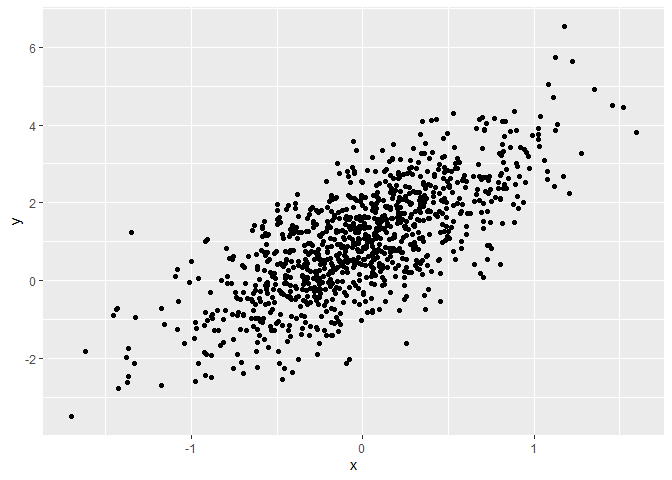
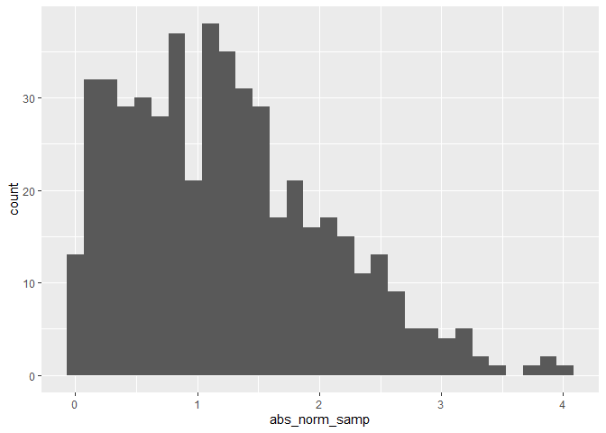

Simple document
================

$ html\_document: toc: TRUE toc\_float: TRUE code\_folding: hide$

I’m an R Markdown document!

# Section 1

Here’s a **code chunk** that samples from a *normal distribution*:

``` r
samp = rnorm(100)
length(samp)
```

    ## [1] 100

# Section 2

I can take the mean of the sample, too! The mean is 0.2355554.

# Section 3

let’s write a new code chunk.

this code chunk imports the `tidyverse`, creates a data frame, and makes
a histogram.

``` r
library(tidyverse)
```

    ## -- Attaching packages --------------------------------------- tidyverse 1.3.1 --

    ## v ggplot2 3.3.5     v purrr   0.3.4
    ## v tibble  3.1.4     v dplyr   1.0.7
    ## v tidyr   1.1.3     v stringr 1.4.0
    ## v readr   2.0.1     v forcats 0.5.1

    ## -- Conflicts ------------------------------------------ tidyverse_conflicts() --
    ## x dplyr::filter() masks stats::filter()
    ## x dplyr::lag()    masks stats::lag()

``` r
set.seed(1234)

plot_df=
  tibble(
    x = rnorm(1000, sd= 0.5),
    y = 1 + 2*x + rnorm(1000)
  )

ggplot(plot_df, aes(x=x)) +geom_histogram()
```

    ## `stat_bin()` using `bins = 30`. Pick better value with `binwidth`.

<!-- -->

``` r
ggplot(plot_df, aes(x=x, y=y)) + geom_point()
```

<!-- -->

``` r
library(tidyverse)

la_df = tibble(
  norm_samp = rnorm(500, mean= 1),
  norm_samp_pos = norm_samp > 0,
  abs_norm_samp = abs(norm_samp)
  )

ggplot(la_df, aes(x = abs_norm_samp)) + geom_histogram()
```

    ## `stat_bin()` using `bins = 30`. Pick better value with `binwidth`.

<!-- -->
